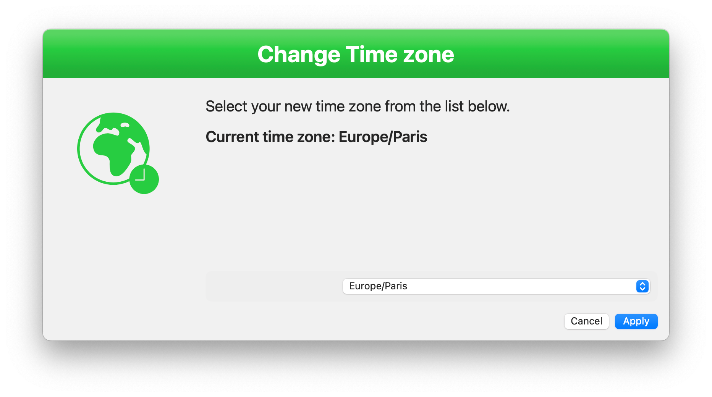

# macOS Time zone setup

Script to use in Jamf Pro to allow a non-admin user to change its timezone via Self Service.

I encounter an issue with one of my customers where they don't want to enforce Location Services, but still want a non-admin user to change the timezone for its Mac. And sadly in recent versions of macOS it seems impossible to change the time zone in System settings for a non-admin user. Therefore, this.

The script relies on the wonderful [SwiftDialog](https://github.com/swiftDialog) to do its magic. The script will install it automatically if needed (check the contents of the script if you don't want this).

## How to use

Add the script in Jamf Pro, create a policy in Jamf Pro, and set it up as a Self Service policy. The policy should just need to run the script. That's it, no other action. You should make the policy on an Ongoing frequency. No need to require an Inventory update each time.

## Localizations

The script is provided in English and French, and you can of course add your own localizations.

## Icons

I added icons created with SFSymbol to customize your Self Service policy. Feel free to use any of them according to your region.
